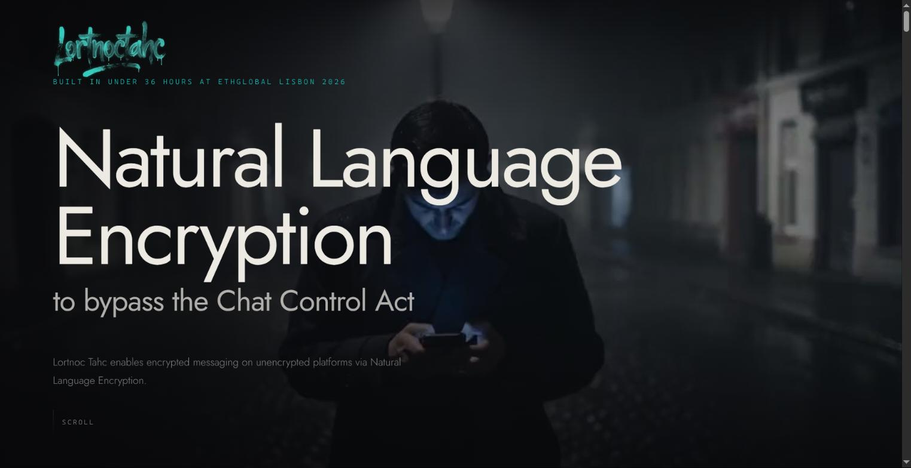
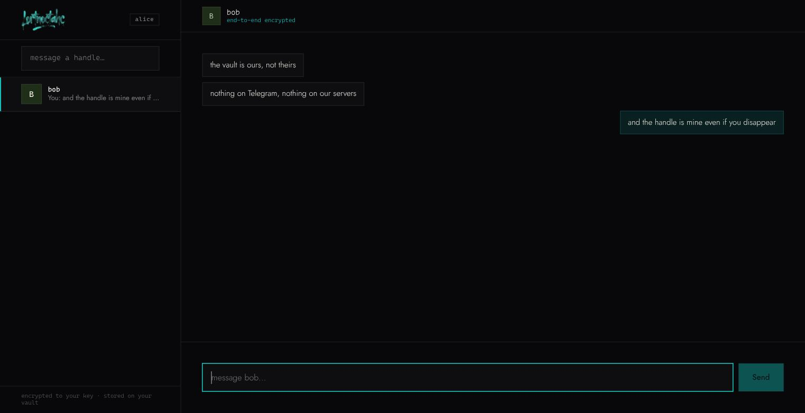
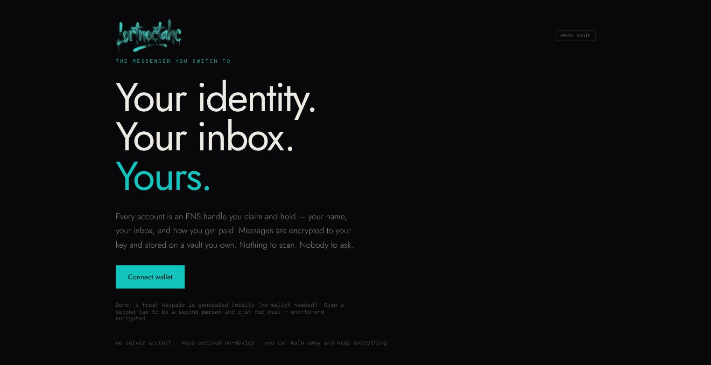
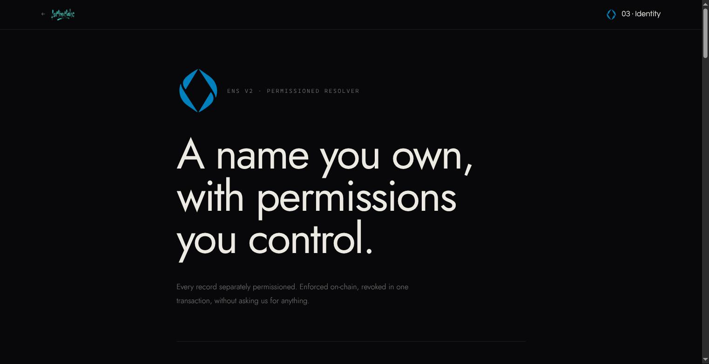
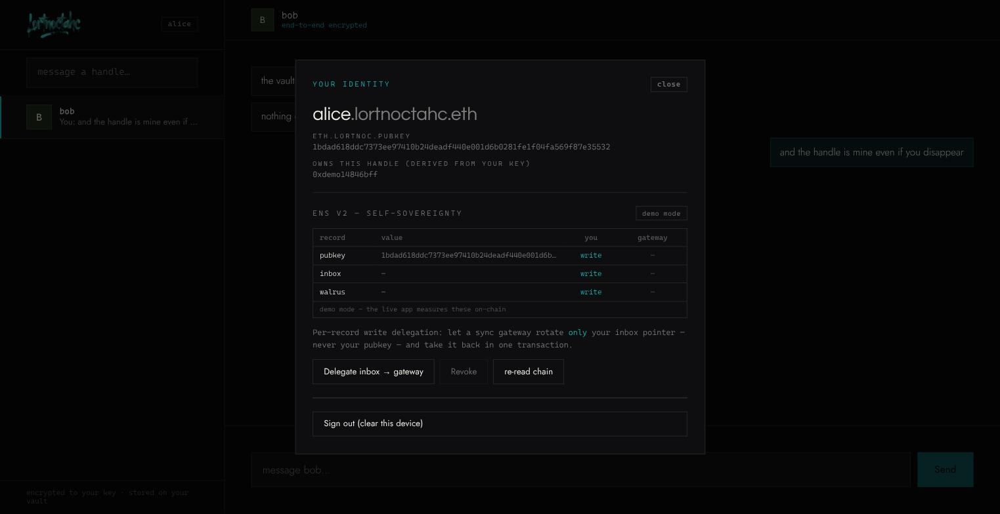
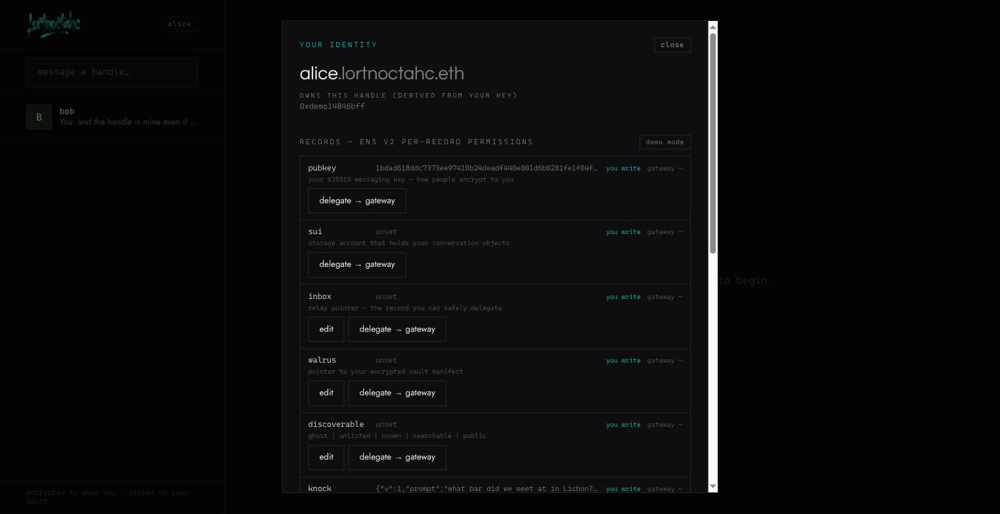
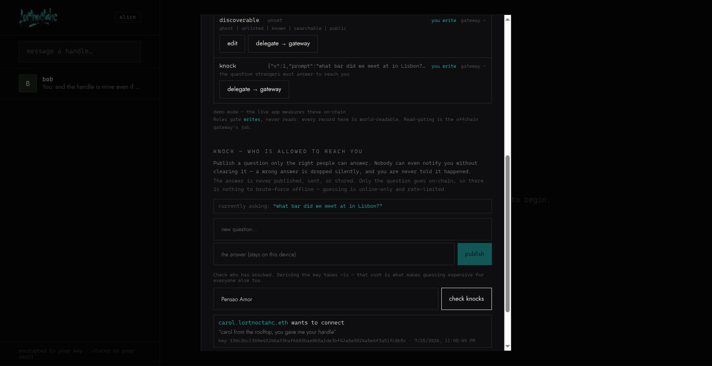
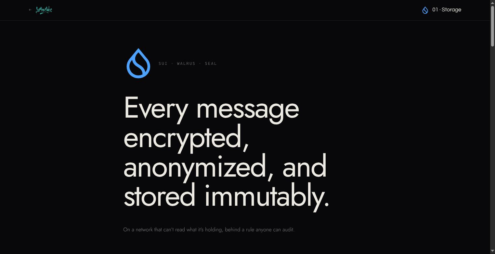

# lortnoc_tahc

**Encrypted messaging on unencrypted platforms.** You type a real message in Telegram. Before it
sends, an overlay swaps it for innocuous cover text — and that cover text is all Telegram ever
stores. Your correspondent, running the same extension with the same derived key, sees it decode
back inline. Everybody else sees small talk.

Then there's the second half: a messenger you can walk away with. Your handle is an ENS name you
own, your messages live in a vault you control, and the membership that pays for it can't be
linked to the handle it bought.

Built at **ETHGlobal Lisbon 2026**.



> **Positioning:** this is a privacy / stealth-comms product. The language model that generates
> cover text is invisible plumbing — never the pitch.

---

## What's actually live

Everything below is deployed and was exercised with real transactions, not mocked.

| Layer | Where | Address / id |
|---|---|---|
| Handles | Ethereum Sepolia | `lortnoctahc.eth` · registry `0x2D95c86b…62a5` · registrar `0x794ec3b1…2c19` |
| Membership | **0G mainnet** (16661) | `LortnocMembership` `0xe9031484…e3d6` — real money, $1 |
| Storage | Sui testnet + Walrus | package `0xb214da01…4faf` |
| Codec | fly.io | `lortnoc-codec.fly.dev` |
| Sealed inference | fly.io + 0G Compute | `lortnoc-zerog.fly.dev` |
| Relayer | fly.io | `lortnoc-relayer.fly.dev` |

Four handles have been issued. Three of them are owned by wallets that **have never sent a
transaction on any chain** — because the relayer paid, not them. More on why that matters below.

---

## The two surfaces

### 1. The extension — hiding messages inside Telegram

A Chrome MV3 extension that runs a content script on `web.telegram.org`. No bot, no MTProto, no
stored session credential: you are a human typing in your own Telegram, and the extension only
reads and writes the DOM. That removes the ToS and ban risk entirely.

**Outbound.** It intercepts the send path, encrypts your text with AES-SIV under a key only you and
your correspondent can derive, posts the ciphertext to the codec, and replaces your compose box
with the cover text that comes back. Plaintext never leaves the page.

**Inbound.** A `MutationObserver` watches new message bubbles, sends each to the codec to decode,
and tries to decrypt. **The AES-SIV auth tag is the detector** — a valid tag means this was one of
ours and it renders decoded inline; an invalid tag means it's ordinary chatter and is left alone.
There's no marker to spot, because there is nothing to mark.

#### The handshake — how two people get a key without ever sending one

This is the part worth understanding, because it is what makes the whole thing work with **no
passphrase, no server, no wallet and no gas**.

You click **Connect**. Your extension generates a fresh X25519 keypair, wraps the *public* half in
a 41-byte frame, runs it through the same codec a message goes through, and sends the result as an
ordinary Telegram message. Your correspondent's extension recognises it, replies the same way, and
both sides now hold the same conversation key.

```
A clicks Connect  →  OFFER frame  →  cover text  →  sent as a normal message
B taps Accept     →  ACK   frame  →  cover text  →  sent as a normal message
                                  →  both now hold K_conv
```

**Two messages.** That is the whole exchange. To Telegram, and to anyone reading over your
shoulder, it is two more lines of small talk.

**The key is never transmitted — it is derived.** Only public keys cross the chat. Both ends
compute:

```
K_conv = HKDF( ECDH(my_private, their_public), info = sorted(both public keys) )
```

ECDH is symmetric, so `ECDH(a, B) == ECDH(b, A)`: the same key on both sides, and nothing secret
ever travelled. Sorting the two public keys into the HKDF info means it does not matter who offered
and who accepted — both arrive at the same value.

**The frame.** `MAGIC("LTNC") · type · x25519_pubkey(32) · crc32` = 41 bytes. It is encoded but
**not encrypted** — it carries a public key, and there is no shared key yet; that is the
chicken-and-egg the handshake exists to break. The magic prefix and CRC are how a receiver tells a
handshake frame apart from an AES-SIV message and from genuine chatter. Frames skip the 0G
best-of-N pass (`fast: true`), so they take ~2–3s instead of ~10s — cover polish is wasted on a
sentence nobody reads.

**If you both click Connect at once** (the "glare" case) it still works: each side establishes from
the other's offer. It costs two extra cover messages, because both also send a now-redundant ACK.

**There is exactly one way a chat is keyed.** An earlier version also supported a shared passphrase,
and that was removed — not for simplicity, but because two keying paths meant the two ends could
silently pick *different* ones, and each would then read only its own messages while the peer's
stayed cover text. No key now means no key: a visible state rather than a silent wrong answer. If
several messages decode but fail the authentication tag, the extension says *"key mismatch —
reconnect"* instead of leaving garble on screen.

##### What this does and does not protect against

| | |
|---|---|
| Telegram sees | two innocuous sentences |
| A person reading your screen sees | small talk |
| Another extension user watching the chat | can tell a handshake happened and read both public keys — harmless, but not hidden |
| An active man-in-the-middle on the **first** exchange | **is not stopped** |

That last row is the honest limit: the in-band handshake is **TOFU** — trust on first use. Nothing
authenticates that the public key in that OFFER belongs to who you think it does, so someone
positioned to substitute messages could interpose on the very first exchange.

That is an accepted trade for a free tier that needs no wallet and no gas. It is closed on the paid
path, where a peer's key comes from an **ENS text record on a name they provably control**
(§5.3 Tier 2) instead of from a chat bubble — same ECDH, authenticated key.

### 2. The app — the messenger you switch to



Same crypto, no Telegram. Your handle resolves through ENS, messages are encrypted client-side and
stored on Walrus, and a Sui object points at them.



Sign in is not authentication against a server — there is no server account. You sign one fixed
message, and that signature deterministically re-derives every key you have.

---

## One signature, every key

Everything hangs off a single master secret `MS`, derived from one wallet signature (RFC 6979
makes ECDSA deterministic, so the same wallet and message reproduce it on any device). Raw
sub-keys never leave the device.

```
wallet signature ──► MS ──┬──► K_msg   X25519    messaging key, published to ENS
                          ├──► K_own   secp256k1 OWNS your handle  ← never the wallet that paid
                          ├──► K_sui   Ed25519   pays for Walrus storage
                          ├──► K_conv  AES-SIV   per-conversation, via ECDH with your peer
                          └──► id_sem  Semaphore anonymous membership identity
```

`K_own` is the one worth pausing on. The wallet you connect **pays**; a key derived from `MS`
**owns the handle**. One signature, two addresses, and the only thing connecting them lives inside
`MS` on your laptop. There is no second wallet to manage and nothing extra to back up.

---

## How ENS is used



We use **ENS v2** on Sepolia — not v1 — because the thing we want is impossible in v1.

**We own the whole chain of custody.** `lortnoctahc.eth` sits in the v2 `ETHRegistry`.
`LortnocRegistry` (a `UserRegistry` proxy from the canonical `VerifiableFactory`) is slotted
underneath it. So resolution genuinely traverses: RootRegistry → `eth` → `lortnoctahc` →
LortnocRegistry → your handle → **your own resolver**.

**Every handle gets its own resolver.** Not a shared one with us as admin — a `PermissionedResolver`
proxy that only you administer. `LortnocRegistrar.claim()` does all of it in **one transaction**:

1. deploys your resolver proxy through the canonical factory
2. writes `eth.lortnoc.pubkey` on it
3. grants you every root role
4. **revokes its own**
5. registers the subname pointing at it

The registrar is admin for exactly one transaction and holds nothing afterwards. Anyone can call
it — no allowlist, no gatekeeper.

**Per-record write delegation is the flagship.** ENS v2's Enhanced Access Control lets you grant
write access to *one text record*:

```solidity
authorizeTextRoles(name, "eth.lortnoc.inbox", gateway, true)
```

That gateway can now rotate your inbox pointer and **nothing else** — not your pubkey, not your
storage pointer. Revoke it with the same call and `false`. The identity panel reads this live off
your resolver, where each cell is an `eth_call` against the real authorisation path rather than a
claim about what should happen:



`scripts/ens/demo.mjs` asserts the whole thing end-to-end — 12 checks covering grant, the boundary,
and revoke.

**Trustless handle proof.** `VerifiableFactory.verifyContract(proxy)` returns the implementation
your resolver was deployed from. Compare it to the canonical `PermissionedResolverImpl` and you've
proven the handle is genuine without trusting anything we say.

**Records we publish** (§5.4): `eth.lortnoc.pubkey` (messaging key), `.sui` (storage account),
`.inbox` (relay pointer), `.walrus` (vault pointer), `.discoverable` (findability rung),
`.knock` (the contact challenge, below).

The panel is an admin surface, not a readout: every record can be edited, and every record can be
delegated or revoked independently.



> `lortnoc.eth` is registered to the same owner and deliberately unused — it's what makes the
> `eth.lortnoc.*` record namespace a name we control rather than a borrowed prefix.

### Knock — challenge-gated contact

Publishing a handle means anyone can reach you. Knock (§6.8) makes reachability something you set,
without a public directory and without trusting a server.

1. You publish `eth.lortnoc.knock = {prompt, salt, kdf}` — **the question, never the answer**.
2. A stranger derives `k = Argon2id(answer, salt)` and sends `XChaCha20-Poly1305(k, {pubkey, intro})`.
3. You derive `k` from the answer *you* know and try to open each pending knock. Auth tag verifies
   ⇒ *"X wants to connect"*, with their key attached. Auth tag fails ⇒ silently dropped, and you
   are never told it happened.



Two properties fall out of that shape:

- **No offline brute-force.** Nothing published commits to the answer, so there is nothing to
  attack at rest. Guessing is online-only, costs an Argon2id derivation (~0.9s at RFC 9106
  settings) per attempt, and the relay rate-limits to 6/minute.
- **The knock *is* the key exchange.** A successful one carries the sender's X25519 key, so
  accepting bootstraps `K_conv` in the same step — no separate handshake.

The relay stores sealed blobs it cannot read and cannot classify: a wrong-answer knock and a
right-answer knock are indistinguishable to it, and to the sender. Only the recipient can tell.

> **Honest limit:** trivia is low-entropy. This is spam-resistance and intentional contact, **not**
> cryptographic access control. Argon2id and rate-limiting slow guessing; they don't stop someone
> who knows you well. Use a high-entropy shared password if you need real secrecy.

---

## How 0G is used


Two roles, and one thing we deliberately do **not** do.

**Sealed inference — cover-text selection.** Every message is encoded several ways, and 0G Compute
judges which reads most naturally. That's live in the send path through `lortnoc-zerog.fly.dev`.

**What we don't do: run the codec on 0G.** Reversible steganography needs full-vocabulary token
logprobs and byte-deterministic inference. Hosted GPU inference gives neither — the API doesn't
expose full distributions, and a shared batched fleet isn't deterministic even at `temp=0`, which
breaks reversibility. We asked the 0G team about deploying our own model into their TEE; they
confirmed it isn't supported. So **the codec runs locally on a pinned GPT-2**, and we say so
plainly rather than claiming otherwise.

**Anonymous membership — settled on 0G mainnet.** This is where payment lives:

| Contract | Address |
|---|---|
| `LortnocMembership` | `0xe9031484b6fd4f55bf94dc5b768f7031b04be3d6` |
| `Semaphore` | `0xd21f911570aad19d39e750fe0aa4e2ad161cbdd5` |
| `SemaphoreVerifier` | `0x87997f3ca40693fb1e0c3c6f39f0f3fe287b8c67` |
| `PoseidonT3` | `0x114e261b9d901aaea199544539c9873dc93565ef` |

Price is **5.666942 0G = $1.00**, set from the live rate and repeggable. Fees forward to the
treasury on receipt, so the contract never holds a balance. A Galileo testnet deployment
(`0x219f68fd…0e11e`) exists for development.

> Deploying Semaphore needs care: its bytecode ships an **unlinked** `__$…$__` PoseidonT3
> placeholder, so the library must be deployed and linked first. 0G's `eth_estimateGas` also
> rejects viem's EIP-1559 fields, so transactions are priced legacy with explicit gas.

---

## How Walrus is used



Messages are encrypted client-side, written to **Walrus** as blobs, and pointed at by a
**`ConversationHead`** shared object on Sui. Walrus is the durable log — not a realtime bus — so
reads poll the head.

Writes go through Mysten's **upload relay**; writing direct to storage nodes fails from most
networks with `NotEnoughBlobConfirmations`. The relay fans out for a small SUI tip.

**Seal is a real access-control layer here, not an encrypt-library.** The Move module ships a
working `seal_approve` that key servers dry-run before releasing a key share, and it requires
*both*:

1. the identity being decrypted is namespaced to **this** head object, and
2. the caller is a participant.

Verified by dry-run: member approved, stranger refused, and a member reaching for another
conversation's identity refused.

The storage account is `K_sui`, derived from `MS` — so no separate Sui wallet, and a paid
membership funds it automatically.

> **Cost reality:** Walrus bills the *encoded* size, and metadata is ~64 KB **per shard regardless
> of blob size**. Every blob under ~217 KB bills identically. One-blob-per-message is therefore a
> pricing catastrophe (~$16–316/user/year); Quilt batching brings the same workload to
> ~$0.03–0.48. **Quilt batching is specified but not yet implemented** — the current code writes
> one blob per message.

---

## How payment and registration work

Paying, registering and becoming a member are one act — and the payment cannot be linked to the
handle it buys.

### The user's experience: two transactions

You arrive holding ETH. The shop takes 0G.

1. **Bridge ~$1 of ETH → 0G.** One transaction via LI.FI, any of Ethereum/Base/Arbitrum/Optimism.
   Measured on mainnet: **0.0035 ETH → 35.78 0G in 20 seconds**, $0.13 gas.
2. **Pay.** `join()` inserts your Semaphore identity commitment into the paid-members set.

The UI prices everything in dollars, because "5.67 0G" means nothing to someone arriving with ETH,
and it polls until 0G actually credits — the source transaction confirming is *not* the finish
line, and paying eight seconds early just fails.

### What happens underneath

```
1. pay        join(commitment)              0G      "a wallet paid, the member tree grew"
2. prove      Groth16 proof, in-browser     —       "I am SOME member" — never which one
3. relay      POST /claim {label, proof}    —       the relayer carries it across chains
4. burn       spendTicket(proof)            0G      nullifier spent — one handle per membership
5. issue      claimFor(label, pubkey, you)  Sepolia handle issued to YOUR derived address
6. fund       SUI + WAL + a little gas      Sui     storage the membership just bought
```

The proof's public signal binds `(label, evmAddr, suiAddr, pubkey)`. Change any one of them and
the proof stops matching — which is what stops the relayer, or anyone replaying the ticket, from
pointing the claim somewhere else. **Binding the pubkey is not optional:** without it a relayer
could publish a messaging key it controlled and read everything sent to your handle. The app
re-verifies the published key after claiming as a second line of defence.

**The claimant never burns their own ticket.** Semaphore hides *which* commitment a proof came
from — it does not hide *who submitted it*. If the paying wallet burned its own ticket, an observer
would see "X paid" and "X burned nullifier N", and N names the handle. The anonymity set would
collapse to one no matter how large the crowd. So the relayer submits, and your entire on-chain
footprint stays the bridge and the payment.

### What the relayer can and cannot do

| | |
|---|---|
| **Cannot** forge a claim | No burned ticket ⇒ nothing to relay |
| **Cannot** redirect a claim | The binding pins label, owner, storage account and key |
| **Cannot** read your messages | The pubkey is bound, and re-verified after the fact |
| **Can** censor or stall | Accepted. `spendTicket` is permissionless and the relayer set is a list — anyone can run one |
| **Cannot** learn which payment funded a ticket | Nobody can, including us |

### The honest version of the privacy claim

**Unlinkability, not invisibility.** The zero-knowledge proof hides *which handle a payment
unlocks*. It does not hide *that a payment happened* — that transaction is public. Privacy is the
size of the paid crowd: with one member, a payment and a handle appearing minutes apart is
obviously the same person. The guarantee grows with membership.

The free tier is **deliberately not anonymous** — it's metered by Telegram handle, and only the
paid tier gets the unlinkability guarantee. These don't conflict; we just have to say both.

---

## Repository layout

```
extension/    Chrome MV3 overlay for Telegram Web
app/          Lortnoc DM — React + Vite messenger
codec/        GPT-2 steganographic codec (Python), + 0G sidecar
contracts/    LortnocRegistrar (Sepolia), LortnocMembership (0G)   — Foundry
relayer/      cross-chain claim service (0G → Sepolia → Sui)
shared/       ticket.mjs — the proof binding, ONE implementation
scripts/ens/  deploy, claim, status, demo, membership, bridge, relayer CLIs
site/         marketing site
docs/         PRDs and this README's screenshots
```

`shared/ticket.mjs` deserves a note: the ticket binding is security-critical and is imported by the
app, the CLI *and* the relayer. Two copies would eventually disagree, so there is one.

---

## Running it

```bash
# the app — demo mode needs no wallet and no chain
cd app && npm install && npm run dev       # http://localhost:5273/?mock
                                           # open a second tab to be a second person

# live mode (real chains, needs MetaMask on Sepolia)
npm run dev                                # http://localhost:5273/

# the extension
cd extension && npm install && npm run build
# load extension/dist as an unpacked extension, then open web.telegram.org

# the codec
cd codec && pip install -r requirements.txt && python server.py

# check the chains — read-only, no key needed
node scripts/ens/status.mjs                # the ENS layer
node scripts/ens/status.mjs alice          # one handle's records
curl -s https://lortnoc-relayer.fly.dev/health
```

Reproducing the deployment (a fresh chain, a rotated pin) is documented in
[`app/docs/LIVE-SETUP.md`](app/docs/LIVE-SETUP.md).

## Build it yourself

The extension is distributed as a zip on [GitHub Releases](https://github.com/forever8896/lortnoc_tahc/releases/latest) —
built in public CI from the tagged commit, never from anyone's laptop. You don't have to trust that:

```bash
git checkout v0.7.0            # the tag the release was cut from
cd extension && npm ci && npm run build
# compare extension/dist against the unzipped release
```

Every release ships a **SHA-256** (check it matches the zip you downloaded) and a GitHub
**build-provenance attestation** you can verify against the source commit:

```bash
gh attestation verify lortnoc-tahc-v0.7.0.zip -R forever8896/lortnoc_tahc
```

Note: the build is *verifiable* (public CI, pinned `package-lock.json`, provenance), not bit-for-bit
reproducible — Vite emits content-hashed filenames, so trust the provenance + checksum, not a byte diff
of the archive. **Install:** unzip → `chrome://extensions` → Developer mode → Load unpacked → the folder.

---

## Known limits

We'd rather write these down than have you find them.

- **The browser flow has not been click-tested end to end.** Every layer is verified independently
  and the full path works from the CLI, but nobody has driven connect → bridge → pay → prove →
  claim through the UI by hand.
- **Quilt batching isn't implemented.** Storage cost is ~650× worse than it should be.
- **`ConversationHead` stores participant handles in cleartext**, so who-talks-to-whom is public on
  Sui. Cheap to fix, not yet fixed.
- **The treasury is a hot key.** Membership fees land in a wallet whose key lives in a container
  env. Two transactions to move it; not yet moved.
- **The contracts are unaudited** and were written in a weekend. Exposure is bounded — the
  membership contract can't withdraw from users, can't touch the member set, and holds no balance.
- **Storage is recurring.** Walrus blobs expire; a mainnet epoch is two weeks. "A vault you can
  walk away with" needs renewal, so price it per year.
- **The relayer is a liveness dependency.** It can't forge or redirect, but it can stall. If it's
  down the app falls back to the free claim path.
- **The in-band handshake is TOFU.** No active-MITM protection on the first key exchange in
  Telegram (see above). Resolved via ENS on the paid path; not resolved on the free one.
- **No forward secrecy.** Conversation keys are independent of one another, so compromising one
  reveals one conversation. But the app's messaging key is long-term and derived from `MS`, so
  compromising *that* exposes every conversation it ever had, including past ones. A Signal-style
  ratchet is the fix and is not implemented.

---

## Prize tracks

**0G** — anonymous membership settled on 0G mainnet with a deployed Semaphore stack, plus sealed
inference in the live send path. **ENS** — per-user Permissioned Resolvers with per-record write
delegation, one-transaction claim, and `verifyContract` handle proofs on ENS v2. **Sui** — Walrus
storage behind a real `seal_approve` policy with a `ConversationHead` object.

## Licence & credits

Codec approach informed by `nethical6/conversation-steganography`. Built on ENS v2, Semaphore v4,
Sui/Walrus/Seal, 0G, and LI.FI.
